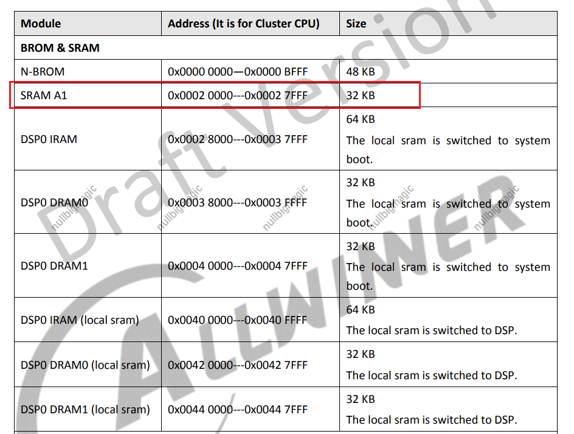
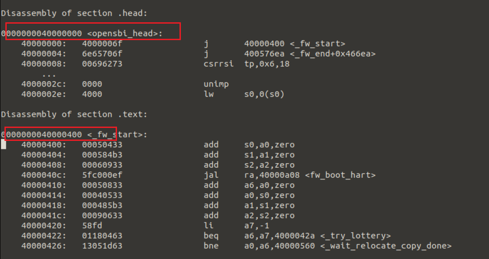

# 2.关于全志SDK编译系统启动部分的研究

通过进入

```
tina-d1-open/lichee/brandy-2.0
```

文件夹，直接输入

```
./build.sh
```

就可以进行代码编译了。

里面有`spl`、`opensbi`和`u-boot`的代码。

### spl阶段

从内存的布局上来说，主要分为下面几部分



然后通过反汇编来查看基本的信息。


从不同的模式下启动，有着不同的引导程序。

通过随便反汇编一个程序，可找到入口地址

```
riscv64-linux-gnu-objdump -D boot0_nand.elf > 1.txt
```

不难看到第一阶段的启动实际上在SRAM A1中。


为什么会有

```
boot0_nand
boot0_spinor
boot0_sdcard
```

应该是支持这三种启动模式，分别到不同的地方去取固件。

## opensbi阶段

这个阶段编译出来的固件，会放到

```
brandy-2.0/opensbi/build/platform/thead/c910/firmware
```

文件夹中，然后通过下面的分析得到启动地址。

找到`fw_jump.elf`。



实际的入口应该从`0x40000000`处入手。