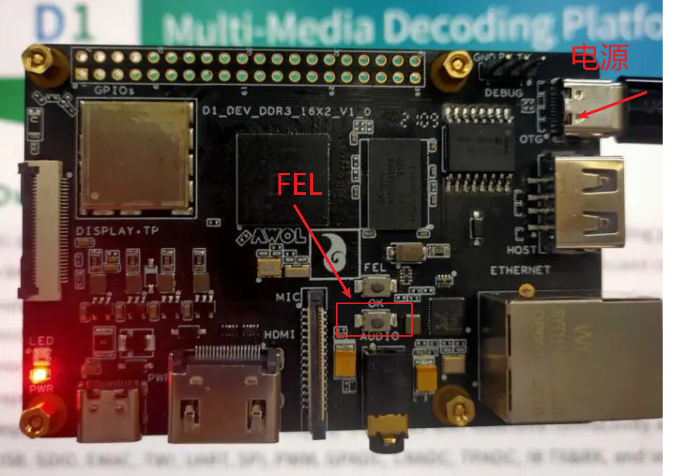
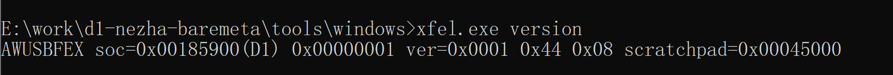
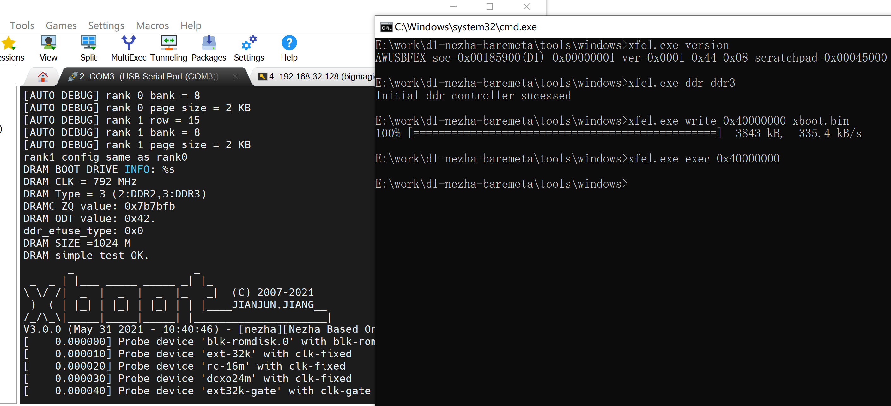

# d1下载xboot的过程

[toc]

## 编译

d1如何下载xboot

首先编译下载xfel，具体的编译步骤可以参考

```
sudo apt-get install binutils-mingw-w64-i686 gcc-mingw-w64-i686
sudo apt-get install autoconf automake libtool
```

然后通过设置

```
下载 libusb源代码: 
git clone https://github.com/libusb/libusb.git

编译libusb源码：
cd libusb
./autogen.sh
./configure --host=i686-w64-mingw32 --prefix=/usr/i686-w64-mingw32/
make
make install
```


## 下载

按下板子的第二个按键

通过长按FEL健，然后开启电源



通过编译好的xfel.exe进行下载。

```
xfel.exe version
AWUSBFEX soc=0x00185900(D1) 0x00000001 ver=0x0001 0x44 0x08 scratchpad=0x00045000
```

可以看到如下的现象



表示连接成功。

然后输入下面三条指令开始下载

```
xfel.exe ddr ddr3
xfel.exe write 0x40000000 xboot.bin
xfel.exe exec 0x40000000
```


需要注意的是D1s(f133)内置的DDR是DDR2


可以用下面的命令下载：

```
xfel.exe ddr ddr2
xfel.exe write 0x40000000 xboot.bin
xfel.exe exec 0x40000000
```


可以看到如下的现象：



此时表示下载成功。

