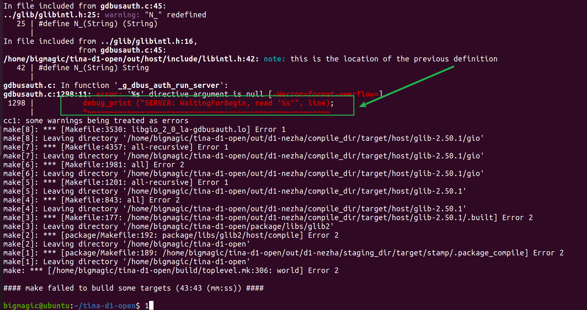

# 关于全志D1开发环境的搭建

[toc]

## 1.说明

本文主要介绍在ubuntu20.04上搭建开发环境。

```
https://d1.docs.allwinnertech.com/study/study_2getsdk/
```

首先上传ssh公钥。

https://open.allwinnertech.com/#/sdk/264

可以通过公钥管理进行

```
2、安装repo引导脚本
请客户使用AW提供的引导脚本和repo仓库，如已安装了google官方引导脚本，请将官方引导脚本替换成AW提供的引导脚本。

1.从全志服务器下载安装repo引导脚本，将username替换成客户下载账号的用户名

$ git clone ssh://username@sdk.allwinnertech.com/git_repo/repo.git

2.修改repo/repo文件中下面一行，将username替换成客户下载账号的用户名

REPO_URL='ssh://username@sdk.allwinnertech.com/git_repo/repo.git'

3.把repo引导脚本添加到自己计算机环境变量中

$ cp repo/repo /usr/bin/repo $ chmod 777 /usr/bin/repo
```

文档如下：

```
V1.01 SDK仓库下载说明
1.上传公钥
2.安装repo引导脚本 查看详情
3.下载代码
下载服务器统一为：sdk.allwinnertech.com
下载请注意：如有lichee和android两仓库，务必放在同一级目录

$ mkdir tina-d1-open
$ cd tina-d1-open
$ repo init -u ssh://bigmagic@sdk.allwinnertech.com/git_repo/D1_Tina_Open/manifest.git -b master -m tina-d1-open.xml
$ repo sync
$ repo start product-smartx-d1-tina-v1.0-release --all # 全部下载完成之后，创建分支
```

## 2.需要安装的软件

如果是新的电脑，那么需要安装如下的软件

```
sudo apt-get install build-essential subversion git-core libncurses5-dev zlib1g-dev gawk flex quilt libssl-dev xsltproc libxml-parser-perl mercurial bzr ecj cvs unzip lib32z1 lib32z1-dev lib32stdc++6 libstdc++6 -y
```

## 3.编译可以按照下面的步骤进行

```
source build/envsetup.sh
lunch d1_nezha-tina
make -j32
pack
```

## 4.解决编译错误

对编译的错误的解决办法



```
#gdbusmessage.c文件，路径为：./out/d1-nezha/compile_dir/target/host/glib-2.50.1/gio/gdbusmessage.c
gdbusmessage.c:2698:30:
      if (signature_str)
      tupled_signature_str = g_strdup_printf ("(%s)", signature_str);

#这个文件路径还请自行查找
dbusauth.c 1298
      if (line == NULL)
            goto out;
          debug_print ("SERVER: WaitingForBegin, read '%s'", line);
```

改变如下

```
vim out/d1-nezha/compile_dir/target/host/glib-2.50.1/gio/gdbusmessage.c +2698
```

各种

```
      if(signature_str != NULL)
      {
              tupled_signature_str = g_strdup_printf ("(%s)", signature_str);
      }
```

对设置


```
vim out/d1-nezha/compile_dir/target/host/glib-2.50.1/gio/gdbusauth.c +1298
```

改成如下的

```
          if(line != NULL)
          {
                  debug_print ("SERVER: WaitingForBegin, read '%s'", line);
          }
```

