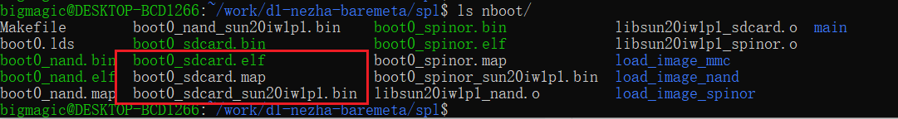
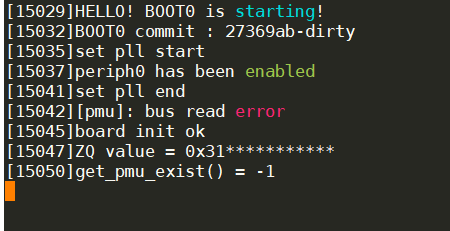

# 5.关于spl的编译和烧录

本工程提供了d1 riscv的 spl版本，借助这个版本，可以深入的研究底层的配置

## 1.编译

首先进入spl目录。

配置GCC，下载gcc的过程可以在百度网盘上下载。

```
链接：https://pan.baidu.com/s/1Mpfv_6BlarLSVZcgs548HQ 
提取码：mipy 
```

接着解压到Linux系统中。

```
export PATH=/home/bigmagic/work/toolchain-thead-glibc/riscv64-glibc-gcc-thead_20200702/bin:$PATH
```

配置GCC的环境即可。

输入make开始编译。

正常情况下，可以生成如下的文件



## 2.下载

程序编译完成后，就可以进行下载的过程

将`boot0_sdcard_sun20iw1p1.bin`放到windows平台上。

输入下面的指令即可

```
xfel.exe write 0x20000 boot0_sdcard_sun20iw1p1.bin
xfel.exe exec 0x20000
```

最后可以看到串口的输出结果如下



表示实验成功。