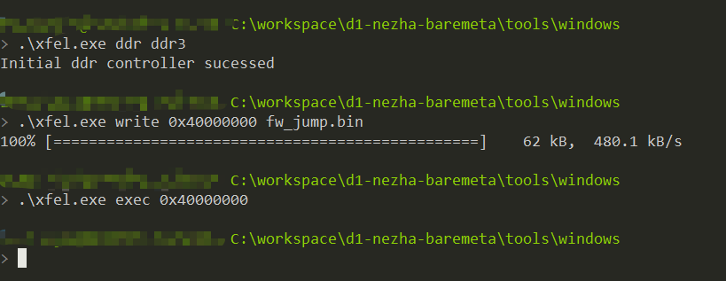
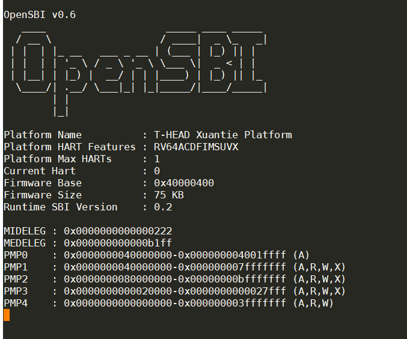

# 6.opensbi的编译与下载

要想在d1上运行opensbi，首先需要根据下面的情况进行编译。

```
cd d1-nezha-baremeta/opensbi
```

然后导入环境变量

```
export CROSS_COMPILE=/home/bigmagic/work/toolchain-thead-glibc/riscv64-glibc-gcc-thead_20200702/bin/riscv64-unknown-linux-gnu-  PLATFORM_RISCV_ISA=rv64gcxthead FW_JUMP_ADDR=0x40200000 FW_TEXT_START=0x40000000
```

最后进行编译

```
make PLATFORM=thead/c910
```

正常情况下，生成

```
AS        platform/thead/c910/standby-normal/standby.o
 CC        platform/thead/c910/standby-normal/loadelf.o
 CC        platform/thead/c910/sunxi_platform.o
 CC        platform/thead/c910/opensbi_head.o
 AS        platform/thead/c910/sunxi_cpuidle.o
 CC        platform/thead/c910/sunxi_idle.o
 AR        platform/thead/c910/lib/libplatsbi.a
 AS        platform/thead/c910/firmware/fw_dynamic.o
 ELF       platform/thead/c910/firmware/fw_dynamic.elf
 OBJCOPY   platform/thead/c910/firmware/fw_dynamic.bin
 AS        platform/thead/c910/firmware/fw_jump.o
 ELF       platform/thead/c910/firmware/fw_jump.elf
 OBJCOPY   platform/thead/c910/firmware/fw_jump.bin
```

可以把`build/platform/thead/c910/firmware/fw_jump.bin`文件下载。



可以通过下面的三条指令进行下载

```
.\xfel.exe ddr ddr3
.\xfel.exe write 0x40000000 fw_jump.bin
.\xfel.exe exec 0x40000000
```

最后可以看到启动如下

