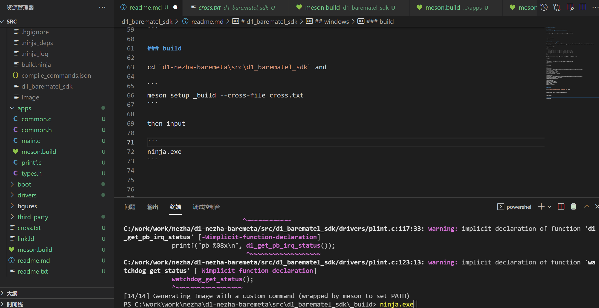
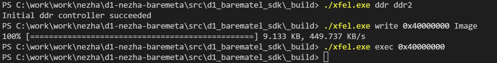
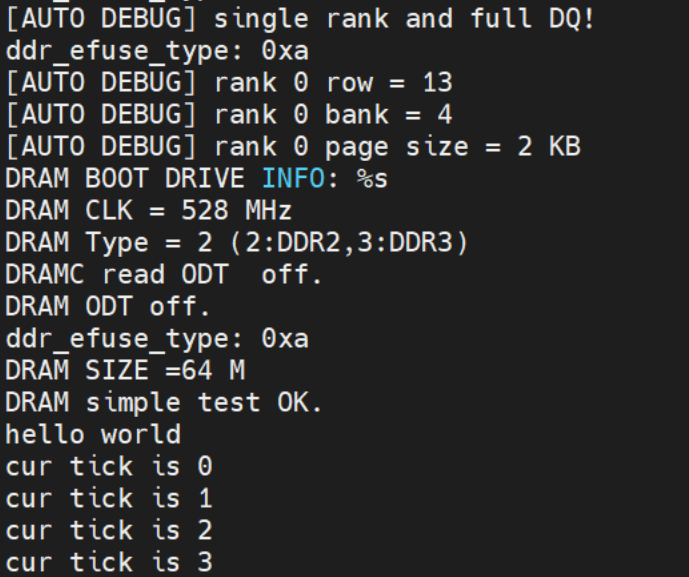

# d1_barematel_sdk

## windows
### 1.download python and configure meson

```
https://www.python.org/downloads/release/python-3102/
```

if you put 
```
meson --version
0.58.1
```

### add file and compilation

There is meson.build under each directory, you can add your own code files to participate in the compilation.

apps/meson.build

```
sources += [
   join_paths(meson.current_source_dir(), 'main.c'),
   join_paths(meson.current_source_dir(), 'common.c'),
   join_paths(meson.current_source_dir(), 'printf.c'),
]
```

First you need to change the cross compilation toolchain path.

windows

```
链接：https://pan.baidu.com/s/1pu61DYlg5pkZd0xdYALi5Q 
提取码：wrsw 
```

cross.txt

```
[binaries]
cross_pass = 'C:\work\work\d1\riscv64-elf-mingw\bin\riscv64-unknown-elf-' 
c = cross_pass + 'gcc'
cpp = cross_pass + 'g++'
ar = cross_pass + 'ar'
strip = cross_pass + 'strip'

[properties]
cross_pass = 'C:\work\work\d1\riscv64-elf-mingw\bin\riscv64-unknown-elf-' 
objcopy = cross_pass + 'objcopy'
needs_exe_wrapper = true

[host_machine]
system = 'bare metal'
cpu_family = 'riscv64'
cpu = 'c906'
endian = 'little'
```

### build

cd `d1-nezha-baremeta\src\d1_barematel_sdk` and

```
meson setup _build --cross-file cross.txt
```

then input

```
ninja.exe
```



### download and run

you can remove `d1-nezha-baremeta\tools\windows\xfel.exe` to `d1_barematel_sdk\_build`.

download:

```
./xfel.exe ddr ddr2
./xfel.exe write 0x40000000 Image
./xfel.exe exec 0x40000000
```



run:


